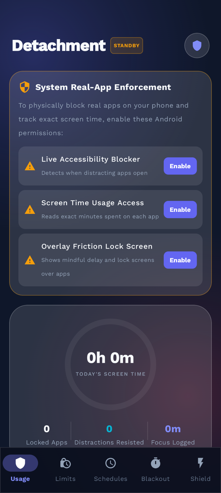
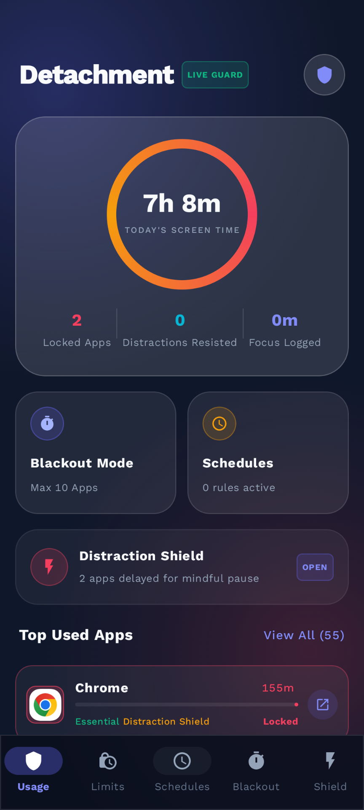
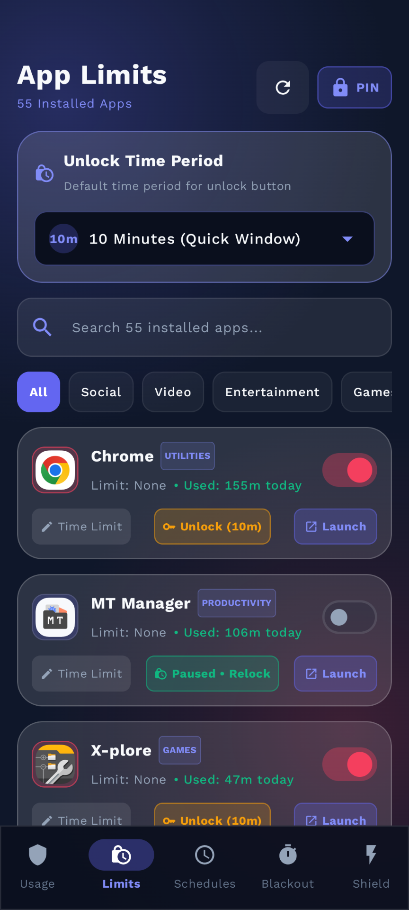
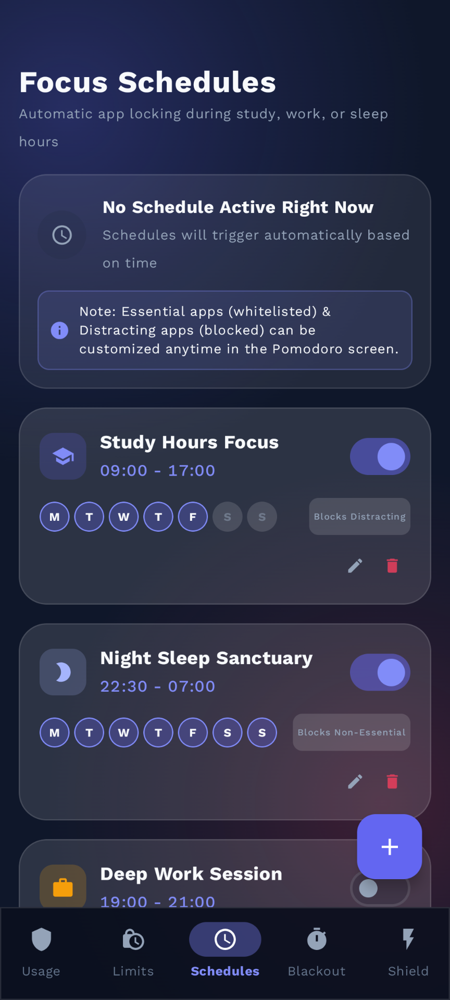
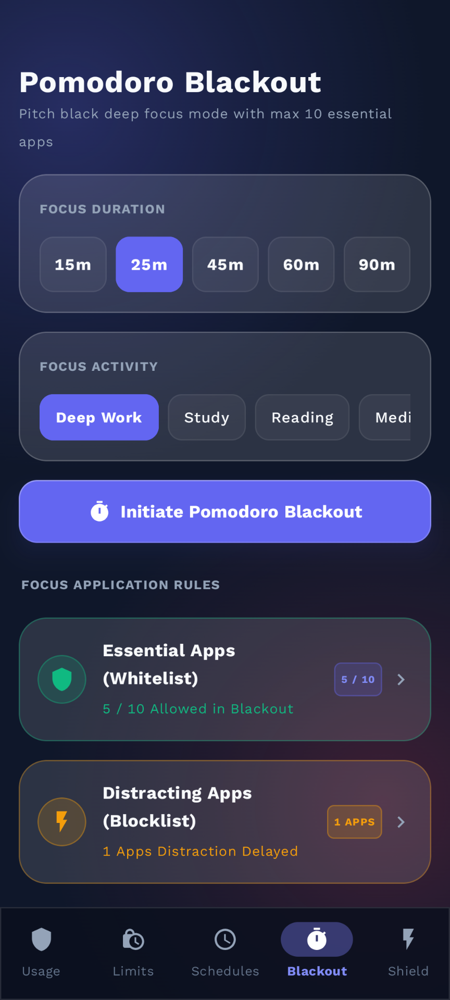
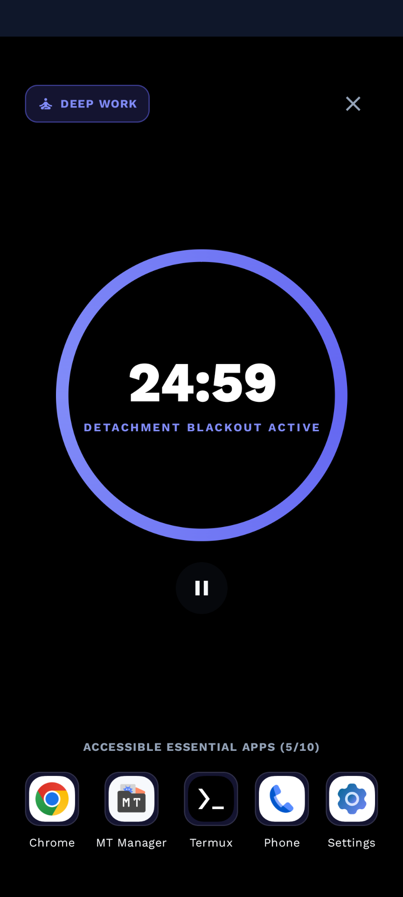
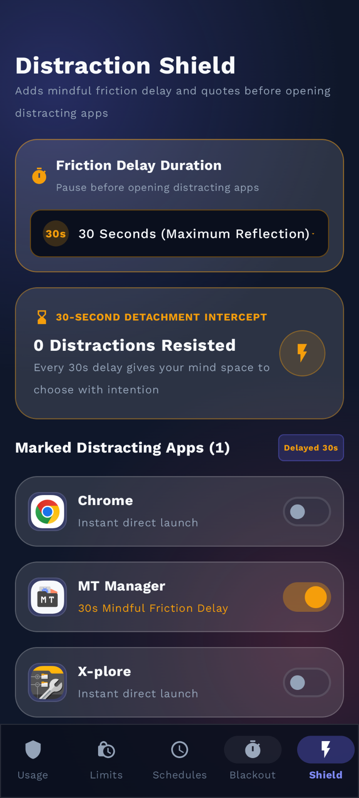
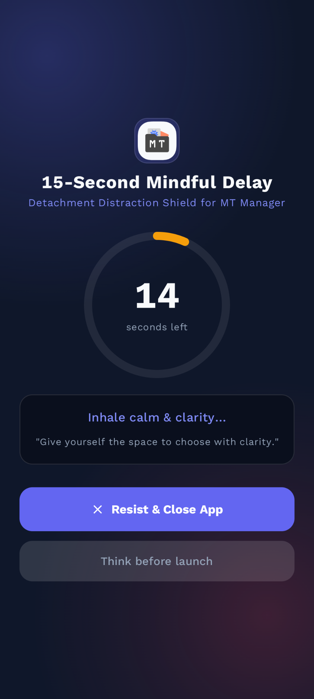
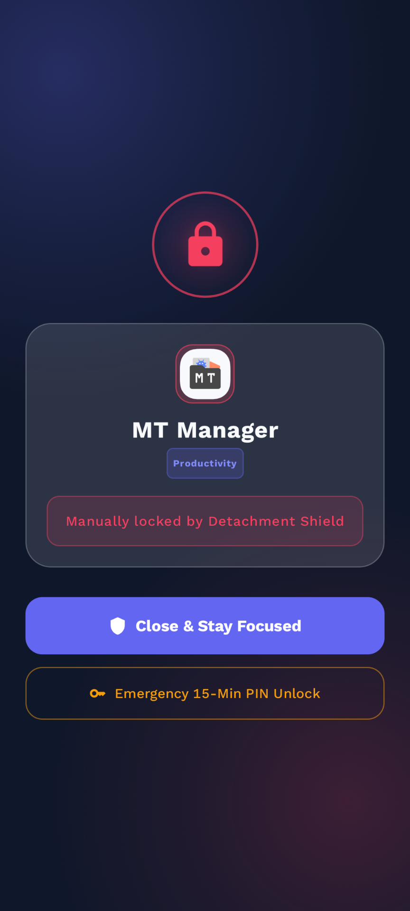

# 🧘‍♂️ Detachment — Digital Mindfulness & Screen Time Control

**Detachment** is a digital mindfulness, habit interruption, and screen time management Android application built using modern **Kotlin**, **Jetpack Compose (Material 3)**, and **Room Database**. 

Detachment empowers users to reclaim their focus and attention through intentional friction, intelligent app time limits, Pomodoro blackout sessions, automated focus schedules, and Distraction Shield to delay app launches.

---

## 🌟 Key Features

### ⏳ Per-App Screentime Limits & Emergency Unlock:
* Configure individual daily usage limits in minutes or hours for any installed app.
* When an app exceeds its limit (or is manually locked), an App Lock Screen is presented.
* Master Passcode to unlock the app for breaks. When period expires, the app automatically relocks. Users can also manually relock the app early at any point.

---

### 🛡️ Distraction Shield (Habit Loop Interrupter): 
* Designate apps as "Distracting".
* Every attempt to launch a distracting app triggers a full-screen customised delay time period mindful intercept with live second countdown to build positive willpower habits.

---

### 🍅 Pomodoro Blackout Mode
* Pitch-Blackout canvas featuring a glowing countdown timer, session activities (Deep Work, Study, Reading).
* Essential Apps Whitelist: Users can select up to a strict maximum of 10 essential apps (e.g. Phone, Messages, Maps, Calendar, Notes) to remain accessible from the blackout dock while all other phone usage is completely blocked.

---

### 📅 Automated Focus Schedules
* Recurring Time Windows: Set automated focus blocks tailored for Work, Sleep, Morning Focus, or Study routines.
* Automatic Enforcement: The background accessibility engine detects active schedule time slots and enforces blackout restrictions seamlessly.
* Configure customizable ranges, active days of the week, and blocking policies ("Lock Distracting Apps Only" vs "Lock All Non-Essential Apps").

---

### ⚙️ Permissions Required
For full device-level blocking functionality:
1. **Usage Access Permission** (`android.permission.PACKAGE_USAGE_STATS`) — To calculate accurate foreground screen time.
2. **Accessibility Service** (`android.permission.BIND_ACCESSIBILITY_SERVICE`) — To detect launched foreground apps and enforce blocking rules.
3. **Display Over Other Apps** (`android.permission.SYSTEM_ALERT_WINDOW`) — To display the mindful friction and blackout lock overlays over other applications.

---

## 📲 Screenshots 

---

## 🤖 AI Assistance Disclosure

This application has been developed with the assistance of advanced Google Artificial Intelligence models for debugging and some initial code structure. 
